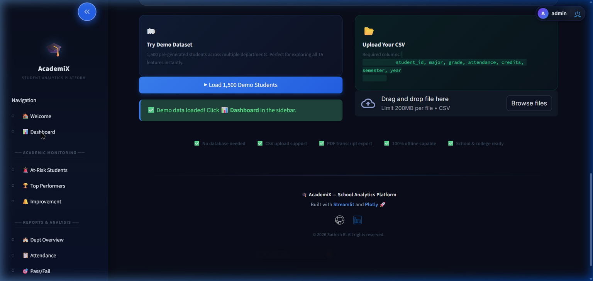
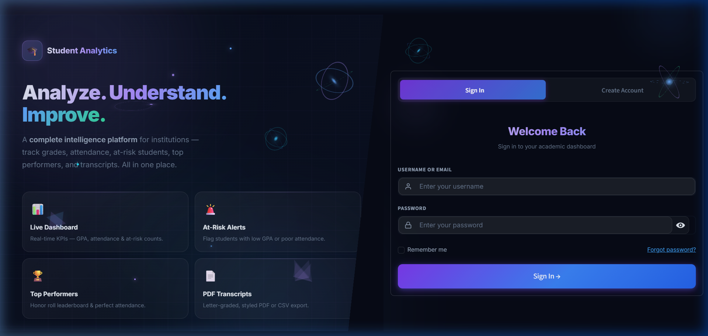

<div align="center">
  
  <br>

  <h1>🎓 AcademiX: Student Analytics Platform</h1>
  
  <p>
    <b>Next-Generation Educational Intelligence & Academic Monitoring</b>
  </p>
  
  <p>
    <a href="#-key-features--capabilities">Features</a> •
    <a href="#-architecture--tech-stack">Architecture</a> •
    <a href="#-installation--rapid-deployment">Installation</a> •
    <a href="#-authority--visionary">Contact</a>
  </p>

  <p>
    
    
    
    
    
    
  </p>

  <br>

  <a href="https://share.streamlit.io/">
    
  </a>

</div>

---

<br>

## 🌟 Executive Summary

**AcademiX** is a masterfully crafted, full-stack data intelligence application engineered specifically for modern educational institutions. By seamlessly bridging complex academic data with an intuitive, premium **"Dark Glassmorphism"** user interface, this platform transforms raw numbers into actionable, life-changing insights for educators.

Replace clunky spreadsheets and legacy CRM software with a lightweight, instantly deployable web application that tracks grades, attendance, at-risk students, top performers, and generates official transcripts—all in one place, requiring **zero code** to operate.

<br>

## 📸 Platform Showcase

<div align="center">
  <table style="border: none;">
    <tr>
      <td width="50%" align="center">
        <b>Dashboard Analytics Engine</b><br><br>
        <br><br>
        <i>Securely fetching and displaying real-time metrics for 1,500+ students from an embedded SQLite database.</i>
      </td>
      <td width="50%" align="center">
        <b>Secure 3D Authentication Portal</b><br><br>
        <br><br>
        <i>Role-based access control nested within a fully responsive, 3D animated deep-space environment.</i>
      </td>
    </tr>
  </table>
</div>

<br>

## ✨ Key Features & Capabilities

### 🛡️ Enterprise-Grade Security & UI
- **Uncompromising Aesthetics**: Built with a bespoke "Dark Glassmorphism" design system featuring vibrant gradients, sleek transparencies, and fluid micro-animations.
- **Sandbox Ready Authentication**: Pre-configured login gateway protecting sensitive academic records.
- **Zero-Click Navigation**: A proprietary "Floating Action Button" (FAB) architecture allows users to effortlessly glide between 15+ comprehensive analytics modules.

### 📈 Advanced Academic Monitoring
- **Live Attendance Heatmaps**: Visual charting of daily, weekly, and semester-long attendance patterns to spot truancy instantly.
- **Grade Distribution Analytics**: Beautiful bell-curve analytics and scatter plots detailing subject-specific performance across all departments.
- **Credit Velocity Tracking**: Monitor exactly how fast students are progressing toward graduation requirements.

### 🚨 Risk & Intervention Engine
- **Predictive At-Risk Identifiers**: Algorithmic flagging of students based on compounding risk factors (e.g., simultaneous attendance drops and grade slips).
- **Top Performer Recognition**: Highlight and automatically group your institution's brightest academic stars for scholarship and honor roll consideration.

### 📄 Administrative Automation
- **Interactive Transcripts**: View complete, holistic 360-degree student profiles in a single, clean interface.
- **One-Click PDF Export**: Generate official, beautifully formatted PDF transcripts instantly for academic boards, university transfers, or parents.

---

## 🏗️ Architecture & Tech Stack

This platform operates as a completely self-contained **Full-Stack Application**, requiring absolutely no complex server configurations or cloud databases to function. 

<div align="center">
  
| Layer | Technologies Deployed | Purpose & Functionality |
| :--- | :--- | :--- |
| **🎨 User Interface (Frontend)** | `Streamlit`, `HTML5`, `CSS3` | Renders the premium UI, dynamic layouts, and Glassmorphism effects. |
| **🧠 Application Logic (Backend)**| `Python 3.9+` | Handles routing, robust state management, and custom Data Access Layer (DAL). |
| **⚙️ Data Processing Engine** | `Pandas`, `NumPy` | Powers the complex statistical aggregations, filtering, and Plotly analytics. |
| **🗄️ Persistence (Database)** | `SQLite 3` | Completely embedded SQL relational database providing frictionless, permanent data storage out-of-the-box. |

</div>

---

## 🚀 Installation & Rapid Deployment

Get the entire full-stack application running on your local machine in under 60 seconds.

**1. Clone the Repository**
```bash
git clone https://github.com/sathishr-ai/student-academic-analytics-platform.git
cd student-academic-analytics-platform
```

**2. Initialize Virtual Environment (Recommended)**
```bash
python -m venv venv

# Windows Activation:
venv\Scripts\activate

# macOS/Linux Activation:
source venv/bin/activate  
```

**3. Install Core Dependencies**
```bash
pip install -r requirements.txt
```

**4. Launch the Application Server**
```bash
streamlit run app.py
```
> 💡 *The application will automatically ignite and open in your default web browser at `http://localhost:8501`.*

<br>

## 🔐 Default Sandbox Access

For immediate testing, recruiter evaluation, and demonstration purposes, utilize the following master credentials on the login screen:

> **Username**: `admin`  
> **Password**: `admin123`

---

## 👨‍💻 Authority & Visionary

Designed, engineered, and maintained by:

<div align="center">
  
  <p><h3>Software Engineer & AI Architect</h3></p>
  <p><i>Building High-Performance, Intelligent Systems with Uncompromising Design</i></p>
  
  <br>

  <a href="mailto:sathxsh57@gmail.com">
    
  </a>
  <a href="https://github.com/sathishr-ai">
    
  </a>
  <a href="https://www.linkedin.com/in/sathish-r-2393412a5">
    
  </a>
</div>

<br>

---

<div align="center">
  <p><b>Student Academic Analytics Platform</b> • Open Source Enterprise Education</p>
  <p>Released under the <a href="LICENSE">MIT License</a>. Copyright © 2026 Sathish R.</p>
</div>
